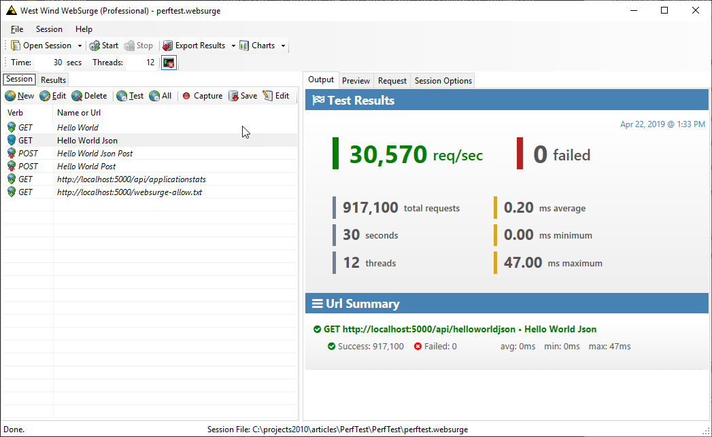

# ASP.NET Core Hello World Tests
##### Simple test project optimized for Hello World style controllers

The goal of this project isn't to come up with hard performance numbers but rather to compare different hosting solutions.

Specifically I use this to compare performance between using raw Kestrel vs. using IIS for InProcess and OutOfProcess hosting.

You can find out more about the hows and why's in this blog post:

*  [ASP.NET Core InProcess Hosting on IIS](https://weblog.west-wind.com/posts/2019/Mar/16/ASPNET-Core-Hosting-on-IIS-with-ASPNET-Core-22)

### What's here
This is **very simple project** that essentially contains a bunch of do-nothing HelloWorld examples. These examples are meant to merely test framework throughput - in this case to a base controller. 

Again this isn't meant to check performance per se, but rather **compare performance between different hosting environments**.

This project has a few simple endpoints set up:

* `api/helloworld`  - plain text output
* `api/helloworldJson` - JSON object output
* `api/helloworldpost` - post a person object
* `websurge-allow.txt` - 2 byte static file 

There are test set up for [West Wind Web Surge](https://websurge.west-wind.com) in `perftest.websurge`. You can open this file in WebSurge or potentially import the requests into another load tester of your choice - `.websurge` files are plain text and use [Fiddler's](https://telerik.com/fiddler) HTTP text formatting so it should be easy to set up requests.

### Testing in WebSurge
You can pick up a [trial version of WebSurge](https://websurge.west-wind.com) from the Web site and open the `perftest.websurge` file which is the easiest to duplicate these example, but feel free to use any other load testing tool.

For testing in WebSurge I test each request individually rather than all together:



To do this select the request you want to test and press `Ctrl-I` to toggle between active and inactive (italic) state. You can move through various requests to test.

* Run tests for at least **60 seconds**. 
* Set the number of threads to **match the number of virtual processors** in your machine for max throughput. You can use higher numbers but you're likely to hit CPU limits and actually get lower request counts.

The test requests are set up for the default Kestrel `http` port on `localhost:5000`. To run tests:

* Do `dotnet publish -c Release`
* Change to the Publish output folder  
  `bin\release\netcore22\publish`
* Run `dotnet perftest.dll`

There are `publish*.ps1` scripts for performing publish and run operations for Kestrel and IIS.

#### Switching Domains for IIS in WebSurge
To use the same WebSurge tests for IIS you can use the **Session Options** and **Replace Domain** to set to a different domain. 

I created a local `perf.west-wind.com` site, added a hosts entry and then changed **Replace Domain** to `perf.west-wind.com` which then hits my IIS server.

You can switch between IIS InProcess and OutOfProcess hosting by change the project's `AspnetCoreHostingModel` setting to `InProcess` or removing the key.

```
 <AspnetCoreHostingModel>InProcess</AspnetCoreHostingModel>
```

There are Powershell scripts for publishing and running the servers locally, both with Kestrel and IIS.

### Perf Tips on Windows
Testing on a local Windows machine is not a precise science due to all the crap that tends to be running on desktop machines. You'll want to minimize what's running on your machine to get semi-consistent results.

Some of the important things to check:

* Turn off Window Defender
* Shutdown all or non-essential apps
* Especially background tasks like Outlook, Slack etc. as they randomly spike perf


Before you run you checks check task manager to see whether some crazy background task like background indexing or recompilation of .NET Framework ngen assemblies is happening. If it is - wait for that to finish :-) 

Yeah - inexact, but the point isn't how fast, but rather comparing between different appproaches.

The static file test on IIS is a good baseline for stability and system perf overall as that seems to stay fairly steady.